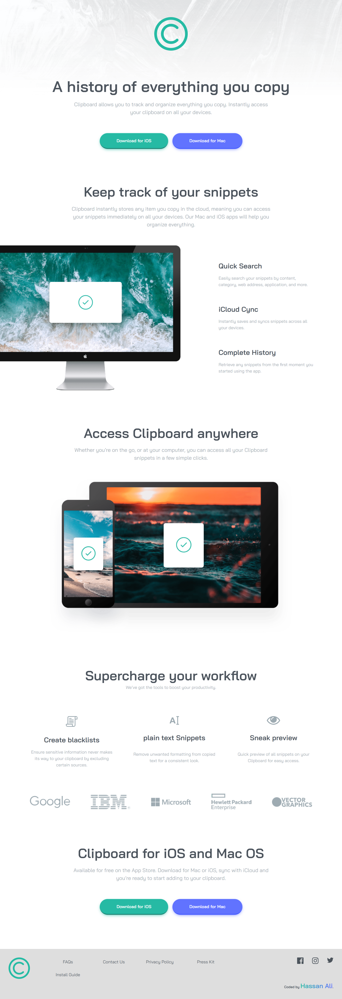
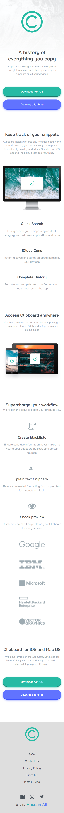

# Frontend Mentor - Clipboard Landing Page Solution

This is my solution to the [Clipboard Landing Page](https://www.frontendmentor.io/challenges/clipboard-landing-page-L5T2sJ) challenge on Frontend Mentor.  
Frontend Mentor challenges help you practice building realistic, production-ready layouts.

---

## 📌 Overview

### 🔹 The Challenge

Users should be able to:

- View the landing page **optimally on all devices**.
- Experience a clean, semantic, and accessible design.
- See smooth hover and focus states for interactive elements.
- Notice consistent spacing and minimalistic layout.

---

## 🖼️ Screenshots

### Desktop

### Mobile

---

## 🌐 Live Demo

👉 [View Live Demo](https://hassan-ali-byte.github.io/clipboard-landing-page-main/)

---

## ⚙️ My Process

### Built With

- ✅ Semantic **HTML5 markup** (`<section>`, `<dl>`, `<dt>`, `<dd>`, `<footer>`)
- 🎨 **CSS custom properties** for colors, typography, and spacing
- 📐 **Responsive units** (`clamp`, `min()`, `rem`, `em`) for scalable design
- ⚡ **CSS Grid** for layout and spacing consistency
- 🎬 **CSS transitions** with `transform` and `opacity` for smooth animations
- 📱 **Mobile-first workflow**

---

## ✨ Highlights

- Practiced **CSS Grid** with `grid-template-areas` and `grid-auto-flow` for flexible layouts.

- Reinforced **fluid typography** with `clamp()` and scalable units.

- Used **semantic HTML** for features list with `<dl>`, `<dt>`, and `<dd>`.

- Applied **min()** for controlling button container width and `auto-fit minmax()` for wrapping navigation links.
- Controlled large images with **max-width** and alignment tricks in grid layouts.

- Improved accessibility using `aria-hidden`, descriptive `alt` text, and `:focus-visible` states.

- ✅ **New skill learned in this project:** styling and animating **SVG icons** with CSS.

---

## 🔗 Resources

- [Josh Comeau – CSS Reset](https://www.joshwcomeau.com/css/custom-css-reset/)
- [Kevin Powell](https://www.youtube.com/@KevinPowell) – CSS tutorials and tips

---

## 👨‍💻 Author

**Hassan Ali**

- Frontend Mentor – [@hassan-ali-byte](https://www.frontendmentor.io/profile/hassan-ali-byte)
- GitHub – [hassan-ali-byte](https://github.com/hassan-ali-byte)

---

✨ Thanks for checking out my solution!  
Feedback and suggestions are always welcome 🙌
